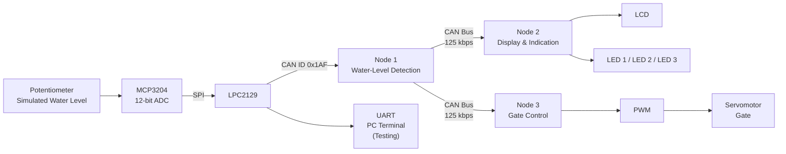

# CAN Bus Based Automatic Water-Level Gate Control System

## Overview

This project is a **CAN bus based automatic water-level gate control system** developed using three **LPC2129** microcontroller nodes.

A potentiometer is used to simulate the water-level sensor. The analog voltage is converted into a digital value using the **MCP3204 ADC** through SPI. The voltage is classified into three water-level ranges:

- **Level 1:** 0.0–1.1 V → Gate fully closed → Servo at **0°**
- **Level 2:** 1.2–2.2 V → Gate partially opened → Servo at **90°**
- **Level 3:** 2.3–3.3 V → Gate fully opened → Servo at **180°**

The detected level is transmitted over the **CAN bus** from Node 1 to Nodes 2 and 3. Node 2 displays the level on an LCD and indicates it using LEDs. Node 3 controls the gate using a servomotor.

UART is connected to Node 1 for testing purposes so that the measured ADC voltage can be observed on a PC terminal.

## Features

- Automatic water-level based gate control
- Three-level water-level classification
- CAN bus communication between three LPC2129 nodes
- MCP3204 ADC interfaced through SPI
- LCD indication of the current water level
- Three LED level indicators
- PWM-based servomotor control
- UART output for testing and monitoring
- Modular distributed-node architecture
- Embedded C implementation using Keil

## System Architecture



### Simple Working Flow

```text
Potentiometer
     │
     ▼
MCP3204 ADC
     │
     ▼
Node 1 (LPC2129)
     │
     ├── UART → PC Terminal (testing)
     │
     ▼
CAN Bus (125 kbps)
     │
     ├──────────────► Node 2
     │                  ├── LCD → LEVEL 1/2/3
     │                  └── LEDs → Level indication
     │
     └──────────────► Node 3
                        │
                        ▼
                    PWM Servo
                        │
                        ▼
                    Gate Position
```

## Hardware Requirements

| Component | Purpose | Quantity |
|---|---|---:|
| LPC2129 | Microcontroller for each CAN node | 3 |
| CAN transceiver | Physical CAN bus interface | 3 |
| MCP3204 | 12-bit ADC for analog voltage measurement | 1 |
| Potentiometer | Simulates water-level sensor | 1 |
| Servomotor | Controls gate position | 1 |
| LCD | Displays water-level status | 1 |
| LEDs | Indicates Level 1, Level 2 and Level 3 | 3 |
| Power supply | Supplies the required circuit power | As required |

## Node Configuration

### Node 1 — Water-Level Detection

Node 1 is responsible for measuring the analog voltage and determining the water level.

1. The potentiometer generates an adjustable analog voltage.
2. The MCP3204 converts the analog voltage into a 12-bit ADC value.
3. The LPC2129 converts the ADC result into voltage.
4. The voltage is classified into one of three levels.
5. The corresponding level value is transmitted through CAN.
6. The measured voltage is also sent through UART for testing.

The project code reads the MCP3204 using SPI and converts the 12-bit ADC result to a 0–3.3 V value. 

```c
return ((adc*3.3)/4096);
```

The implemented SPI/ADC interface is defined in `levels.c`. 

## Node 2 — LCD and LED Indication

Node 2 receives the level information from the CAN bus.

- **Level 1:** LCD displays `LEVEL1`, LED 1 is ON
- **Level 2:** LCD displays `LEVEL2`, LED 2 is ON
- **Level 3:** LCD displays `LEVEL3`, LED 3 is ON
- Unexpected received data results in an `ERROR` display

The three LED outputs are configured on GPIO pins and the received CAN data is checked against the three level values.

## Node 3 — Automatic Gate Control

Node 3 receives the level information through CAN and controls the servomotor using PWM.

| Water Level | Voltage Range | Servo Position | Gate Condition |
|---|---:|---:|---|
| Level 1 | 0.0–1.1 V | 0° | Fully Closed |
| Level 2 | 1.2–2.2 V | 90° | Partially Opened |
| Level 3 | 2.3–3.3 V | 180° | Fully Opened |

The servo software initializes PWM and moves the servo gradually toward the requested position.

## Water-Level Classification

The voltage ranges implemented in Node 1 are:

```text
0.0 V ───────── 1.1 V ───────── 2.2 V ───────── 3.3 V
 │                │                │                │
 ▼                ▼                ▼                ▼
Level 1          Level 2          Level 3
Closed           Partial          Fully Opened
 0°               90°              180°
```

The Node 1 source assigns CAN data values according to these ranges:

| Level | Voltage Range | CAN Data (`byteA`) |
|---|---:|---:|
| Level 1 | 0.0–<1.1 V | 7500 |
| Level 2 | 1.1–<2.2 V | 21750 |
| Level 3 | ≥2.2 V | 36000 |

**Note:** The project description uses the physical operating ranges **0.0–1.1 V, 1.2–2.2 V and 2.3–3.3 V**, while the current Node 1 code uses the exact comparison boundaries `f < 1.1`, `f < 2.2`, and otherwise Level 3. Therefore, the small gaps around 1.1–1.2 V and 2.2–2.3 V are not explicitly represented in the current code.

## CAN Communication

The project uses CAN2 on the LPC2129.

### CAN Configuration

| Parameter | Value |
|---|---|
| Number of CAN nodes | 3 |
| CAN controller | LPC2129 CAN2 |
| CAN bitrate | 125 kbps |
| CAN ID used by Node 1 | `0x1AF` |
| Frame type | Data frame |
| DLC | 4 bytes |
| Data field used | `byteA` |

The CAN driver configures CAN2 for **125 kbps at a 60 MHz peripheral clock** and supports CAN transmit and receive operations.

### CAN Message Mapping

| CAN ID | `byteA` | Meaning |
|---|---:|---|
| `0x1AF` | `7500` | Level 1 |
| `0x1AF` | `21750` | Level 2 |
| `0x1AF` | `36000` | Level 3 |

Node 1 sends the CAN data continuously with a delay between transmissions.

## Software

### Programming Language
**Embedded C**

### IDE / Compiler
**Keil / µVision**

### Peripherals Used

- CAN
- UART
- SPI
- GPIO
- ADC
- PWM
- Timer
- LCD
- LEDs

### Interrupts

The current implementation does **not use interrupts**. CAN, ADC/SPI, UART and other operations are handled using polling/software-controlled routines.

## Project File Structure

```text
CAN-Water-Level-Gate-Control/
│
├── can_driver.c      # CAN2 initialization, transmit and receive
├── delay.c            # Timer-based delay functions
├── header.h           # Common macros, CAN message structure and declarations
├── levels.c            # MCP3204 SPI interface and voltage calculation
├── node1.c             # Node 1: water-level detection and CAN transmission
├── n2main.c            # Node 2: LCD and LED indication
├── n3main.c            # Node 3: servo/gate control
├── servo.c             # PWM servo initialization and movement
├── uart.h              # UART initialization and terminal output functions
├── lcd4bit.h           # LCD 4-bit interface functions
└── types.h             # User-defined integer/float types
```

## How It Works

### Step 1 — Sense the Water Level

The potentiometer is adjusted to produce a voltage between approximately 0 and 3.3 V.

### Step 2 — Convert Analog Voltage

The MCP3204 performs the analog-to-digital conversion. Node 1 reads the ADC result through SPI.

### Step 3 — Determine the Level

Node 1 compares the measured voltage against the configured level thresholds.

### Step 4 — Transmit Through CAN

Node 1 sends the corresponding level value using CAN ID `0x1AF`.

### Step 5 — Display the Level

Node 2 receives the CAN message and:

- Displays the level on the LCD.
- Turns ON the corresponding level LED.

### Step 6 — Control the Gate

Node 3 receives the same CAN information and changes the servo position:

```text
Level 1 → 0°
Level 2 → 90°
Level 3 → 180°
```

Therefore, the gate automatically changes its position according to the detected water level.

## UART Testing

UART is used on Node 1 only for testing and monitoring.

The terminal displays the measured ADC voltage in the following format:

```text
ADC VOLTAGE = X.XX V
```

The UART is configured for **115200 baud** with a 60 MHz peripheral clock in the supplied code.

## Servo Control

The servo is controlled using PWM.

The supplied servo code uses:

- PWM output on `P0.1`
- PWM period of approximately 20 ms
- PWM match register `PWMMR3` for servo pulse control
- Gradual movement toward the requested target

The three received CAN values are mapped to the servo targets:

```text
7500  → Level 1 → 0°
21750 → Level 2 → 90°
36000 → Level 3 → 180°
```

## Build and Run

1. Open the project in **Keil µVision**.
2. Add the source files for the required node.
3. Build the Node 1 firmware and program it into the first LPC2129.
4. Build the Node 2 firmware and program it into the second LPC2129.
5. Build the Node 3 firmware and program it into the third LPC2129.
6. Connect the three nodes through the CAN bus with the required CAN transceivers and bus termination.
7. Connect the potentiometer to the MCP3204 input used by Node 1.
8. Connect the UART output of Node 1 to a PC terminal.
9. Set the terminal to **115200 baud**.
10. Power the system.
11. Adjust the potentiometer to simulate different water levels.
12. Observe the LCD, LEDs and servomotor response.

## Expected Result

| Input Voltage | LCD | LED | Servo | Gate |
|---:|---|---|---:|---|
| Low level | `LEVEL1` | LED 1 | 0° | Fully Closed |
| Medium level | `LEVEL2` | LED 2 | 90° | Partially Opened |
| High level | `LEVEL3` | LED 3 | 180° | Fully Opened |

## Advantages

- Distributed control using multiple CAN nodes
- Automatic gate operation
- Clear visual indication through LCD and LEDs
- Easy testing using a potentiometer
- UART provides useful debugging information
- Demonstrates practical use of CAN, SPI, ADC, PWM and GPIO on LPC2129

## Future Improvements

- Replace the potentiometer with an actual water-level sensor.
- Add CAN communication error handling.
- Add fault detection for sensor or actuator failures.
- Add manual override for maintenance.
- Use CAN interrupts instead of polling.
- Add data logging and remote monitoring.
- Add configurable water-level thresholds.

